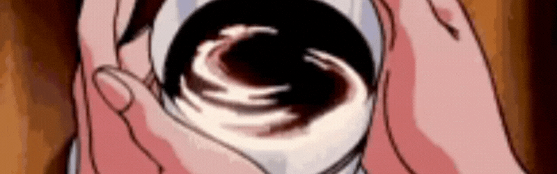

  <picture>
  <source media="(prefers-color-scheme: dark)" srcset="./assets/Black1.png">
  
</picture>

  <picture>
  <source media="(prefers-color-scheme: dark)" srcset="./assets/Black2.png">
  
</picture>
  

   
 
      
      
      
      
      
   
 

 

  

  <picture>
    <source media="(prefers-color-scheme: dark)" srcset="https://raw.githubusercontent.com/samuellbsilva/samuellbsilva/output/github-snake-dark.svg" />
    <source media="(prefers-color-scheme: light)" srcset="https://raw.githubusercontent.com/samuellbsilva/samuellbsilva/output/github-snake.svg" />
    
  </picture>

